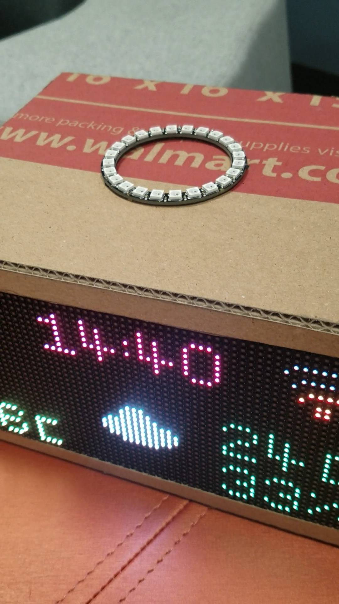
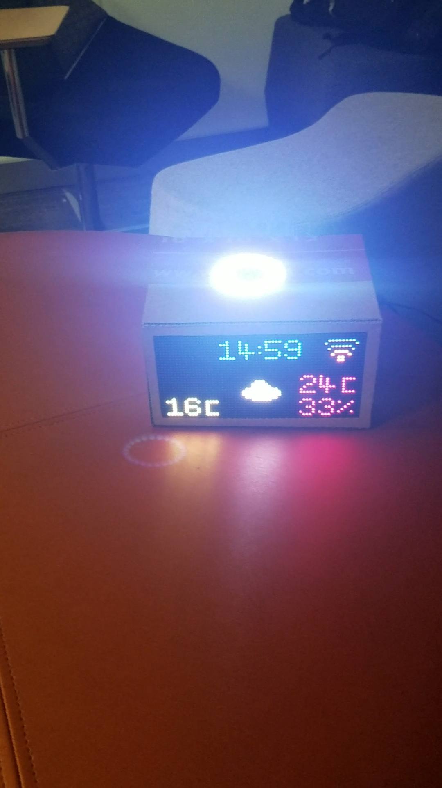

# Smart Clock

## Intent

I completed this project with a partner during my IoT course at the University of Washington Tacoma. Our focus was to bring a tone of innovation by developing an easy to use bedside based Smart Clock with weather and brightness-sensing lamp functionalities, configurable via a user-friendly GUI. The former is convenient to save one’s time taken to prepare in the mornings and the latter ideal for home energy saving purposes. Our model aimed at removing the ambiguity associated with current smart clocks by providing only features we believed were the most useful.

Smart Clock implements clock, lamp and weather functionalities, all displayed by means of LED technology. Time and weather information are displayed on a 32 x 64 LED matrix panel. Smart Clock utilizes a RESTFul web service to retrieve weather information from a weather API.

The information displayed on the LED matrix panel comprises local time (in 24 hour format), outdoor temperature obtained, weather icon associated with the outdoor temperature of the location set by the user, indoor temperature and humidity obtained via a temperature sensor. 

Settings such as color of various text on the LED matrix panel, time interval to query server and and brightness of the lamp are all adjustable through our provided Smart Clock GUI. The lamp feature is accessible via a LED ring located on top of the Smart Clock. The role of this lamp, from an energy saving perspective, is to automatically turn on and off based on the brightness of the room in which it is located. The LED ring/lamp provides a level of brightness that is capable of lightning an entire room, given it is equipped with the appropriate type of light reflection matter.

## Archictectural design

## Completed project

